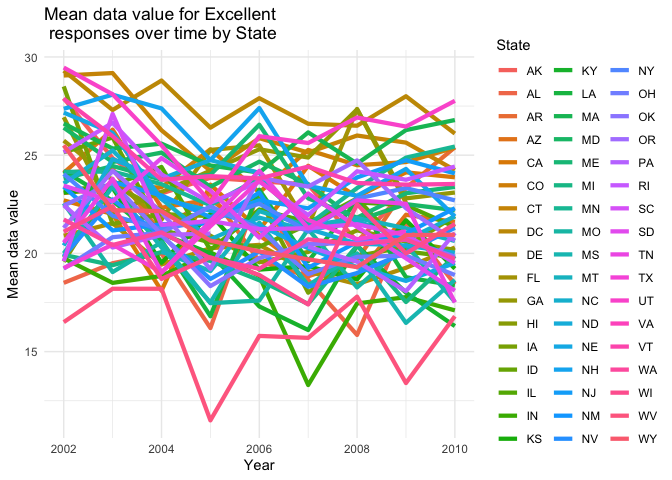
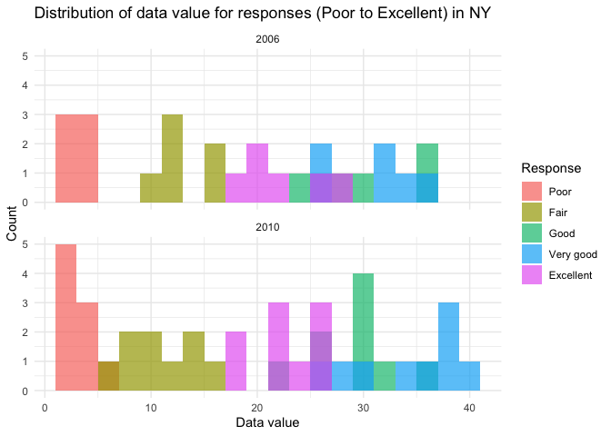
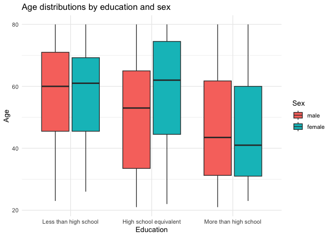
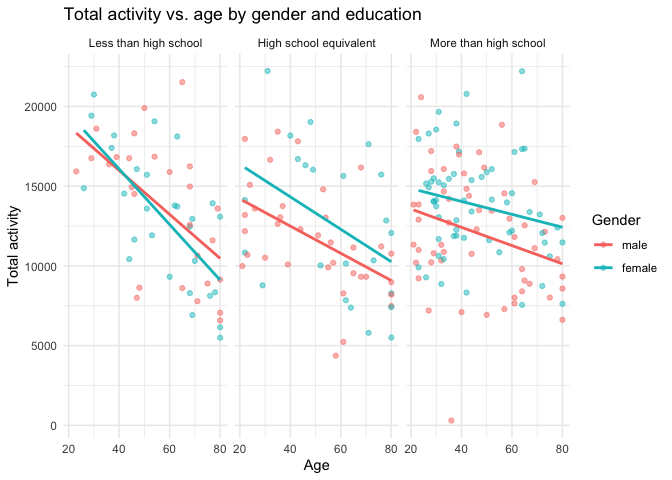
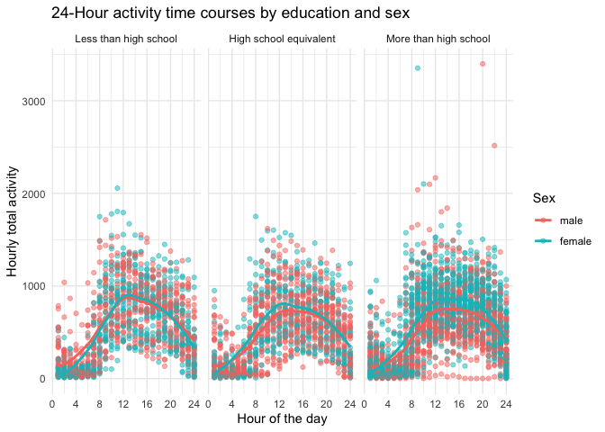

p8105_hw3_wl2926
================
Wenwen Li
2023-10-13

\#Problem 2

``` r
### Load libraries and data. 
library(p8105.datasets)
data("brfss_smart2010")
#print variable names
print(colnames(brfss_smart2010))
```

    ##  [1] "Year"                       "Locationabbr"              
    ##  [3] "Locationdesc"               "Class"                     
    ##  [5] "Topic"                      "Question"                  
    ##  [7] "Response"                   "Sample_Size"               
    ##  [9] "Data_value"                 "Confidence_limit_Low"      
    ## [11] "Confidence_limit_High"      "Display_order"             
    ## [13] "Data_value_unit"            "Data_value_type"           
    ## [15] "Data_Value_Footnote_Symbol" "Data_Value_Footnote"       
    ## [17] "DataSource"                 "ClassId"                   
    ## [19] "TopicId"                    "LocationID"                
    ## [21] "QuestionID"                 "RESPID"                    
    ## [23] "GeoLocation"

### Data Cleaning.

``` r
#Data cleaning
#clean variable names using janitor
brfss_smart2010 <- brfss_smart2010 %>%
  clean_names()
```

``` r
#print unique levels of the "overall_health" variable
unique(brfss_smart2010$response)
```

    ##  [1] "Excellent"                                 
    ##  [2] "Very good"                                 
    ##  [3] "Good"                                      
    ##  [4] "Fair"                                      
    ##  [5] "Poor"                                      
    ##  [6] "Good or Better Health"                     
    ##  [7] "Fair or Poor Health"                       
    ##  [8] "Yes"                                       
    ##  [9] "No"                                        
    ## [10] "Yes, pregnancy-related"                    
    ## [11] "No, pre-diabetes or borderline diabetes"   
    ## [12] "Smoke everyday"                            
    ## [13] "Smoke some days"                           
    ## [14] "Former smoker"                             
    ## [15] "Never smoked"                              
    ## [16] "Neither overweight nor obese (BMI le 24.9)"
    ## [17] "Overweight (BMI 25.0-29.9)"                
    ## [18] "Obese (BMI 30.0 - 99.8)"                   
    ## [19] "Checked in past 5 years"                   
    ## [20] "Not Checked in past 5 years"               
    ## [21] "Never Checked"                             
    ## [22] "Consume 5 or more times per day"           
    ## [23] "Consume less than 5 times per day"

``` r
unique(brfss_smart2010$topic)
```

    ##  [1] "Overall Health"         "Fair or Poor Health"    "Health Care Coverage"  
    ##  [4] "Under 65 Coverage"      "Exercise"               "Diabetes"              
    ##  [7] "Teeth Removed"          "All Teeth Removed"      "Dental Visit"          
    ## [10] "Cardiovascular Disease" "Asthma"                 "Disability status"     
    ## [13] "Current Smoker Status"  "Smoker Status"          "BMI Categories"        
    ## [16] "Alcohol Consumption"    "Binge Drinking"         "Heavy Drinking"        
    ## [19] "Flu Shot"               "Pneumonia Vaccination"  "Mammogram"             
    ## [22] "Pap Test"               "PSA Test"               "Blood Stool Test"      
    ## [25] "Sigmoidoscopy"          "High Blood Pressure"    "Cholesterol Checked"   
    ## [28] "Cholesterol High"       "Arthritis"              "Five Servings per Day" 
    ## [31] "Physical Activity"

### Filter data for the “Overall Health” topic and “Poor” to “Excellent” responses.

``` r
response_range <- c("Poor","Fair","Good","Very good","Excellent")
#filter for "Overall Health" topic and responses from "Excellent" to "Poor"
overallhealth_data <- brfss_smart2010 %>%
  filter(topic == "Overall Health" & response %in% response_range)

#organize responses as a factor with levels ordered from "Poor" to "Excellent"
overallhealth_data$response <- factor(overallhealth_data$response, 
                                      levels = response_range)
```

### Question 1: States observed at 7 or more locations in 2002 and 2010

``` r
states_2002 <- overallhealth_data %>%
  filter(year == 2002) %>%
  group_by(locationabbr, locationdesc) %>%
  summarise(num_locations = n()) %>%
  filter(num_locations >= 7) 
```

    ## `summarise()` has grouped output by 'locationabbr'. You can override using the
    ## `.groups` argument.

``` r
states_2002
```

    ## # A tibble: 0 × 3
    ## # Groups:   locationabbr [0]
    ## # ℹ 3 variables: locationabbr <chr>, locationdesc <chr>, num_locations <int>

``` r
states_2010 <- overallhealth_data %>%
  filter(year == 2010) %>%
  group_by(locationabbr, locationdesc) %>%
  summarise(num_locations = n()) %>%
  filter(num_locations >= 7)
```

    ## `summarise()` has grouped output by 'locationabbr'. You can override using the
    ## `.groups` argument.

``` r
states_2010
```

    ## # A tibble: 0 × 3
    ## # Groups:   locationabbr [0]
    ## # ℹ 3 variables: locationabbr <chr>, locationdesc <chr>, num_locations <int>

In the year 2002, none of the states were observed in 7 or more
locations. The same case applies to the year 2010.  
\### Question 2: Subset a dataset for “Excellent” responses and make a
spaghetti plot.

``` r
excellent_data <- overallhealth_data %>%
  filter(response == "Excellent") %>%
  group_by(year, locationabbr) %>%
  summarise(avg_data_value = mean(data_value))
```

    ## `summarise()` has grouped output by 'year'. You can override using the
    ## `.groups` argument.

``` r
#spaghetti plot
ggplot(excellent_data, aes(x = year, y = avg_data_value, 
                           group = locationabbr, 
                           color = locationabbr)) +
  geom_line(size=1.5) +
  labs(title = "Mean data value for Excellent\n responses over time by State",
       x = "Year",
       y = "Mean data value",
       color="State") +
  theme_minimal()
```

    ## Warning: Using `size` aesthetic for lines was deprecated in ggplot2 3.4.0.
    ## ℹ Please use `linewidth` instead.
    ## This warning is displayed once every 8 hours.
    ## Call `lifecycle::last_lifecycle_warnings()` to see where this warning was
    ## generated.

    ## Warning: Removed 3 rows containing missing values (`geom_line()`).

<!-- -->

There appears to be a generally decreasing trend over time for the
average data value for “Excellent” responses in the “Overall health”
topic.

There appears to be a generally decreasing trend over time for the
average data value for “Excellent” responses in the “Overall health”
topic.

### Question 3: Two-panel plot showing the distribution of “data_value” for responses (“Poor” to “Excellent”) among locations in NY State for 2006 and 2010

``` r
ny_data <- overallhealth_data %>%
  filter(locationabbr == "NY" & year %in% c(2006, 2010))

#two-panel plot
ggplot(ny_data, aes(x = data_value, fill = response)) +
  geom_histogram(binwidth = 2, position = "identity", alpha = 0.7) +
  facet_wrap(~year, ncol = 1) +
  labs(title = "Distribution of data value for responses (Poor to Excellent) in NY",
       x = "Data value",
       y = "Count",
       fill = "Response") +
  theme_minimal()
```

<!-- -->

For NY, the year 2010 had a larger count of observations compared to the
year 2006 in this subset. This included for observations under both the
“Poor” and “Fair” responses on the overall health topic.  
For the year 2010, data values for the various responses were more
consistent compared to the year 2006.

## Problem 3.

### Read the data

``` r
#load accelerometer data
nhanes_accel <- read.csv("nhanes_accel.csv")
#display the structure of the dataset
dim(nhanes_accel)
```

    ## [1]  250 1441

``` r
#load demographic data and skip first 4 rows
nhanes_covar <- read.csv("nhanes_covar.csv", skip = 4)
nhanes_covar <- na.omit(nhanes_covar)

#display the first four rows
str(nhanes_covar,4)
```

    ## 'data.frame':    229 obs. of  5 variables:
    ##  $ SEQN     : int  62161 62164 62169 62174 62177 62178 62180 62184 62189 62199 ...
    ##  $ sex      : int  1 2 1 1 1 1 1 1 2 1 ...
    ##  $ age      : int  22 44 21 80 51 80 35 26 30 57 ...
    ##  $ BMI      : num  23.3 23.2 20.1 33.9 20.1 28.5 27.9 22.1 22.4 28 ...
    ##  $ education: int  2 3 2 3 2 2 3 2 3 3 ...
    ##  - attr(*, "na.action")= 'omit' Named int [1:21] 9 11 12 13 29 43 55 63 71 81 ...
    ##   ..- attr(*, "names")= chr [1:21] "9" "11" "12" "13" ...

``` r
#merge the data sets by "SEQN" (participant identifier)
nhanes_data <- merge(nhanes_accel, nhanes_covar, by = "SEQN")
#exclude participants less than 21 years of age
nhanes_data <- nhanes_data %>%
  filter(age >= 21)
#view dimensions of merged data
dim(nhanes_data)
```

    ## [1]  228 1445

``` r
#convert variables to appropriate data types and order factors
nhanes_data$sex <- factor(nhanes_data$sex, 
                               levels = c(1, 2), 
                               labels = c("male", 
                                          "female"))
nhanes_data$education <- factor(nhanes_data$education, 
                               levels = c(1, 2, 3), 
                               labels = c("Less than high school", 
                                          "High school equivalent", 
                                          "More than high school"))
```

### Question 1: Table for the number of men and women in each education category.

``` r
edu_sex_data <- nhanes_data %>%
  group_by(education, sex) %>%
  summarise(count = n()) 
```

    ## `summarise()` has grouped output by 'education'. You can override using the
    ## `.groups` argument.

``` r
edu_sex_data_wide <- edu_sex_data %>% #convert table to wide format
  spread(key = sex, value = count)
kable(edu_sex_data_wide, 
      caption = "Number of Men and Women in each education category")
```

| education              | male | female |
|:-----------------------|-----:|-------:|
| Less than high school  |   27 |     28 |
| High school equivalent |   35 |     23 |
| More than high school  |   56 |     59 |

Number of Men and Women in each education category

Female participants were the leading observations for the
*`Less than high school`*and *`More than high school`*, whereas male
participants led in the *`High school equivalent`* education
categories.From the table, it is evident that the male participants had
the larger proportion of observations in the dataset due to its having
the larger difference in distribution for the *`High school equivalent`*
education category on comparison with the differences in the other
categories.

### Question 2: Create a visualization of the age distributions for men and women in each education category.

``` r
ggplot(nhanes_data, aes(x = education, y = age, fill = factor(sex))) +
  geom_boxplot() +
  labs(title = "Age distributions by education and sex",
       x = "Education",
       y = "Age",
       fill = "Sex") +
  theme_minimal()
```

<!-- -->

The age distribution of the participants whose education category was
`Less than high school` shows left-skewed distributions for both sexes,
as indicated by the median line of their respective box plots, which
implies larger numbers of older individuals compared to the younger
ones. The males in this category also had a larger range, while the
females had a slightly higher median value.  
For both sexes of the participants whose education category was
`High school equivalent`, their age values indicate left-skewed
distributions, implying larger numbers of older individuals compared to
the younger ones. The median age value of the females was larger
compared to that of male participants. Again, their the male
participants were comparatively younger to their female counterparts,
even though they had the larger number of observations as well as a
wider range of age values.  
Lastly, for the participants whose education category was
`More than high school`, the median values indicate right-skewed
distributions, implying larger numbers of younger individuals compared
to that of the older ones. The male median age value is larger than that
of female participants as well as the range of values.

### Question 3: Aggregate across minutes to create a total activity variable for each participant. Plot total activities against age, comparing men to women and having separate panels for each education level

``` r
#aggregate by sum foreach participant
nhanes_data$total_activity <- rowSums(nhanes_data[, 2:1441], na.rm = TRUE)

#Plot total activities against age by gender and education
ggplot(nhanes_data, aes(x = age, y = total_activity,color = factor(sex))) +
  geom_point(alpha = 0.5) +
  geom_smooth(method = "lm", se = FALSE) +
  facet_wrap(~education) +
  labs(title = "Total activity vs. age by gender and education",
       x = "Age",
       y = "Total activity",
       color = "Gender")+
  theme_minimal()
```

    ## `geom_smooth()` using formula = 'y ~ x'

<!-- -->

This plot compares the total activities against age for men and women,
with separate panels for each education level. For the
`Less than high school` education category, the trend lines show younger
females as more active compared to younger males. At about 45 years of
age, their total activities were about equal, and males were more active
thereafter. For the other education categories, females show more
activeness compared to males. Across all the education and sex
categories, the general trend is that the total activity declines over
age. The rate of decline of the total activity is highest for the
`Less than high school`, and least for the `More than high school`.

### Question 4: Make a three-panel plot that shows the 24-hour activity time courses for each education level and use color to indicate sex.

``` r
#subset columns 2 to 1441, which represent the minutes of the day
minutes_data <- nhanes_data[, 2:1441]

#create a new data frame with hourly activity aggregates
hourly_data <- data.frame(sex = nhanes_data$sex, 
                          education = nhanes_data$education)
#loop through the columns and aggregate every 60 columns=1 hour
hour_labels <- sprintf("hour_%d", 1:24)  #hour labels
for (i in seq(1, ncol(minutes_data), 60)) {
  #calculate the activity sum for each hour, add to the new data frame
  hourly_data[hour_labels[i %/% 60 + 1]] <- 
    rowSums(minutes_data[, i:(i + 59)], na.rm = TRUE)}
#print the first few rows of the new data frame
str(hourly_data)
```

    ## 'data.frame':    228 obs. of  26 variables:
    ##  $ sex      : Factor w/ 2 levels "male","female": 1 2 1 1 1 1 1 1 2 1 ...
    ##  $ education: Factor w/ 3 levels "Less than high school",..: 2 3 2 3 2 2 3 2 3 3 ...
    ##  $ hour_1   : num  52.2 190.4 411.2 126.2 221.6 ...
    ##  $ hour_2   : num  67.5 169.6 378.5 102.1 147.8 ...
    ##  $ hour_3   : num  36.1 172.2 166.1 93.9 58 ...
    ##  $ hour_4   : num  38.4 139.2 138.2 103.8 61.8 ...
    ##  $ hour_5   : num  28.4 99.6 110.8 81.6 34.1 ...
    ##  $ hour_6   : num  32.1 121.2 42.9 68.9 37.2 ...
    ##  $ hour_7   : num  473.7 803.3 46.3 157.2 33.2 ...
    ##  $ hour_8   : num  730 633 158 119 784 ...
    ##  $ hour_9   : num  841 614 397 301 411 ...
    ##  $ hour_10  : num  1121 687 214 664 334 ...
    ##  $ hour_11  : num  1047 908 438 549 645 ...
    ##  $ hour_12  : num  1089 797 563 415 826 ...
    ##  $ hour_13  : num  963 824 486 544 790 ...
    ##  $ hour_14  : num  1113 837 691 502 694 ...
    ##  $ hour_15  : num  839 744 557 384 569 ...
    ##  $ hour_16  : num  1036 890 716 448 703 ...
    ##  $ hour_17  : num  759 694 527 584 718 ...
    ##  $ hour_18  : num  725 943 743 569 853 ...
    ##  $ hour_19  : num  623 649 552 418 521 ...
    ##  $ hour_20  : num  697 454 704 374 719 ...
    ##  $ hour_21  : num  440 486 416 488 709 ...
    ##  $ hour_22  : num  294 732 591 423 803 ...
    ##  $ hour_23  : num  78.9 559.8 515.2 509.9 569.5 ...
    ##  $ hour_24  : num  67.7 265.1 430 552.1 675.9 ...

``` r
#reshape to long format
hourly_data_long <- hourly_data %>%
  pivot_longer(cols = starts_with("hour_"), 
               names_to = "hour", 
               values_to = "hourly_activity") %>%
  mutate(hour=as.numeric(str_extract(hour, "\\d+")))#extract integer part
#preview long format
head(hourly_data_long)
```

    ## # A tibble: 6 × 4
    ##   sex   education               hour hourly_activity
    ##   <fct> <fct>                  <dbl>           <dbl>
    ## 1 male  High school equivalent     1            52.2
    ## 2 male  High school equivalent     2            67.5
    ## 3 male  High school equivalent     3            36.1
    ## 4 male  High school equivalent     4            38.4
    ## 5 male  High school equivalent     5            28.4
    ## 6 male  High school equivalent     6            32.1

``` r
#plot 24-hour activity time courses by education level and sex
ggplot(hourly_data_long, aes(x = as.numeric(hour), 
                             y = hourly_activity, color = factor(sex))) +
  geom_point(alpha = 0.5) + 
  scale_x_continuous(breaks = seq(0, 24, by = 4), 
                     labels = as.character(seq(0, 24, by = 4))) + 
  geom_smooth(method = "loess", se = FALSE) +
  facet_wrap(~education) +
  labs(title = "24-Hour activity time courses by education and sex",
       x = "Hour of the day",
       y = "Hourly total activity",
       color = "Sex") +
  theme_minimal()
```

    ## `geom_smooth()` using formula = 'y ~ x'

<!-- -->

This three-panel plot shows the 24-hour activity time courses for each
education level, using color to indicate sex. For the
`Less than high school` education category, the male and female hourly
activity overlap at different times of the day, with peak activity
occurring at around noon time. For the `High school equivalent`
education category, there is a similar peak of activity at around noon
time, but the female participants were consistently more active after
around the 4th hour of the day. Lastly, for the `More than high school`
education category, the female participants were also consistently more
active after around the 3rd hour of the day. Within this category were
also the largest number of outliers in terms of hourly activity for both
sexes. Notably, after the 12th hour of the day, the loess curve of the
hourly activity for the `More than high school` is more flat compared to
the other education categories, indicating more activeness.
